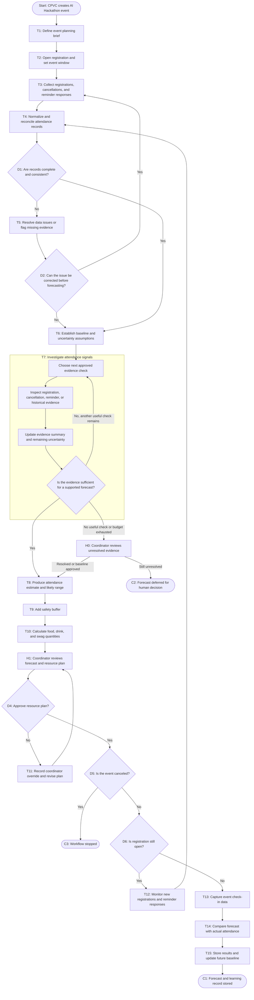

# Workflow of Tasks

*Replace all bracketed prompts with information specific to your proposed system. Delete instructional text that does not belong in your final specification. Add or remove task sections as needed. Every task shown in the general workflow must have a corresponding task specification below.*

## 1. Workflow Overview
### 1.1 Workflow Goal
This workflow supports the system goal defined in `my_first_agent/README.md`.

### 1.2 Workflow Trigger

The workflow starts when CPVC creates an AI Hackathon event and opens registration. It then updates as registrations, cancellations, and reminder responses change, with a final attendance forecast generated before the event.

### 1.3 Completion Condition at Runtime

A run is complete when the system has processed the latest registration, cancellation, reminder, and prior attendance data, generated an attendance forecast with a safety buffer, and provided the recommended quantities for food, drinks, and swag to CPVC organizers.

### 1.4 General Workflow

CPVC creates an event through T1: Define Event Planning Brief, opens registration with T2, and collects registrations, cancellations, and reminder responses through T3. T4: Normalize and Reconcile Attendance Records checks for duplicates, missing information, and conflicting records. If issues exist, T5: Run standard data-quality checks and route exceptions. T6: Establish Baseline and Uncertainty Assumptions applies the historical 40 percent baseline when needed.

T7: Investigate Unresolved Attendance Signals uses a bounded AI agent to choose the next approved attendance-data check based on what issues it finds. The agent can review registration, cancellation, reminder, or historical evidence, but it must stay within its check/time limit and hand unresolved cases to a coordinator. T8: Produce Attendance Estimate and Likely Range creates the forecast, followed by T9: Add Safety Buffer and T10: Calculate Food, Drink, and Swag Quantities.

A coordinator reviews the plan through H1. If changes are needed, T11: Record Coordinator Override and Revise Plan updates it. While registration remains open, T12: Monitor New Registrations and Reminder Responses sends new information back to T4. After the event, T13: Capture Event Check-In Data, T14: Compare Forecast with Actual Attendance, and T15: Store Results and Update Future Baseline complete the workflow.

### 1.5 Workflow Diagram

