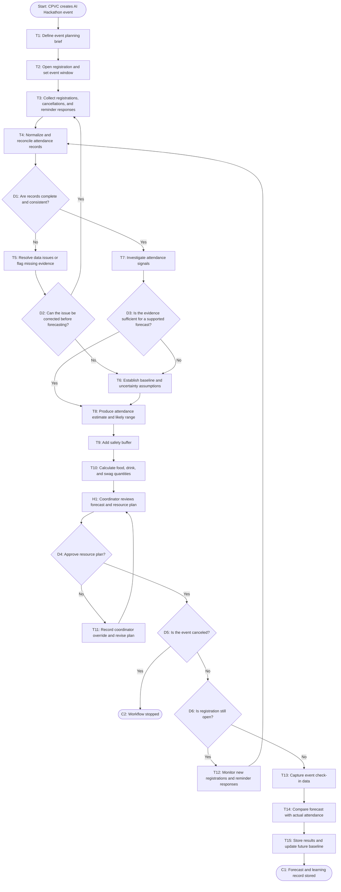

# Workflow of Tasks

*Replace all bracketed prompts with information specific to your proposed system. Delete instructional text that does not belong in your final specification. Add or remove task sections as needed. Every task shown in the general workflow must have a corresponding task specification below.*

## 1. Workflow Overview
### 1.1 Workflow Goal
This workflow supports the system goal defined in `my_first_agent/README.md`.

### 1.2 Workflow Trigger

The workflow starts when CPVC creates an AI Hackathon event and opens registration. It then updates as registrations, cancellations, and reminder responses change, with a final attendance forecast generated before the event.

### 1.3 Completion Condition at Runtime

A run is complete when the system has processed the latest registration, cancellation, reminder, and prior attendance data, generated an attendance forecast with a safety buffer, and provided the recommended quantities for food, drinks, and swag to CPVC organizers.

### 1.4 General Workflow

When CPVC creates an AI Hackathon event, the system collects registration details, event information, cancellations, reminder responses, and relevant attendance history. It cleans and validates the data, estimates expected attendance, calculates a likely range, adds a safety buffer, and recommends quantities for food, drinks, and swag. Coordinators review the forecast and recommendations before purchasing supplies.

If registration or attendance data is incomplete, duplicated, or insufficient for a reliable prediction, the system alerts the coordinators and uses the historical 40 percent attendance rate as a baseline. Coordinators can adjust the final recommendations based on event specific knowledge, such as unusual promotion or scheduling conflicts. After the event, actual check in data is recorded and compared with the forecast so future predictions can improve.

### 1.5 Workflow Diagram

