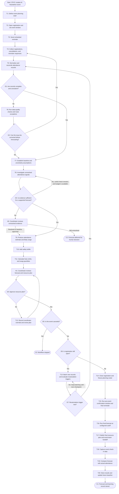

# Workflow of Tasks

## 1. Workflow Overview

### 1.1 Workflow Goal

This workflow helps CPVC forecast attendance for an AI Hackathon and use that forecast to plan food, drinks, and swag while preserving coordinator control and learning from actual attendance.

### 1.2 Workflow Trigger

The workflow starts when CPVC creates an AI Hackathon event, defines its event window, and opens registration. It receives registrations, cancellations, and reminder responses while registration is open, continues through a defined pre-event confirmation window after registration closes, and ends after actual check-in data has been compared with the final forecast.

### 1.3 Completion Condition at Runtime

A run is complete when the system has produced and approved a final attendance forecast, applied the safety buffer, provided resource quantities, handed the plan to event staff, captured check-in data, and stored the forecast-versus-actual learning record.

### 1.4 Forecast Recalculation Policy

The system must not recalculate the forecast for every individual registration or reminder response. Incoming records are normalized and added to a pending-change set. A new forecast is generated only when one of these triggers occurs:

1. An initial planning checkpoint is reached after the first usable registration data is available.
2. A scheduled checkpoint is reached while registration is open, such as the configured daily cutoff.
3. A material-change threshold is reached since the last forecast—for example, a configured net change in expected attendance, a significant cancellation wave, a meaningful shift in reminder responses, or a data-quality issue that could change the estimate.
4. Registration closes and the roster is frozen.
5. The final pre-event forecast cutoff is reached during the post-registration confirmation window.
6. A coordinator explicitly requests a recalculation or records an override.

The system debounces triggers: once a recalculation is queued, additional records are accumulated until that run finishes. Each forecast records its trigger, input timestamp, assumptions, and version so organizers can see why it changed.

### 1.5 General Workflow

CPVC defines the event through T1 and opens registration through T2. T3 sends the configured registration and attendance reminders. T4 collects registrations, cancellations, and reminder responses. T5 normalizes and reconciles the records. If issues exist, T6 runs standard data-quality checks and routes exceptions. T7 establishes baseline and uncertainty assumptions, using the historical 40 percent attendance baseline when no stronger evidence is available.

T8 investigates unresolved attendance signals with a bounded AI agent. The agent chooses only approved evidence checks, stays within its check and time budget, and escalates unresolved cases to a coordinator. T9 produces the attendance estimate and likely range. T10 adds the safety buffer, and T11 calculates food, drink, and swag quantities. H1 is the coordinator review. If changes are needed, T12 records the override and revises the plan.

While registration is open, T13 monitors new records and reminder responses, batches them, and checks the recalculation policy. It routes the workflow back to T5 only when a scheduled, material-change, or manual trigger is met.

When registration closes, the workflow does not go directly to check-in. T14 closes and freezes the planning roster. T15 runs the configured pre-event confirmation window, including the final reminder and collection of late cancellations or reminder responses. T16 runs the final forecast at the pre-event cutoff, after which T17 publishes the operational handoff. T18 captures event check-in data, T19 compares the forecast with actual attendance, and T20 stores the results and updates the future baseline.

### 1.6 Workflow Diagram

## 2. Task Specifications

### T1: Define Event Planning Brief

**Purpose:** Establish the event details needed for forecasting.

**Inputs:** Event name, event date and start time, venue or delivery mode, capacity, resource categories, registration close time, pre-event forecast cutoff, reminder schedule, and material-change thresholds.

**Actions:** Validate required fields and create the event planning record.

**Outputs:** Approved event brief and configured workflow dates and thresholds.

### T2: Open Registration and Set Event Window

**Purpose:** Make the event available for registration and define the active planning period.

**Inputs:** Approved event brief.

**Actions:** Open registration, record the registration-open and registration-close times, and associate the event with its reminder schedule.

**Outputs:** Open registration record and event calendar.

### T3: Send Scheduled Reminder

**Purpose:** Prompt registrants to confirm attendance or report a cancellation.

**Inputs:** Registration roster, reminder schedule, event details, and approved message template.

**Actions:** Send the configured reminder at its scheduled time and record delivery status. Do not treat delivery as a response.

**Outputs:** Reminder-delivery log and a pending-response window.

### T4: Collect Registrations, Cancellations, and Reminder Responses

**Purpose:** Gather attendance evidence after registration opens and after reminders are sent.

**Inputs:** Registration submissions, cancellation notices, reminder responses, and timestamps.

**Actions:** Accept new records, associate responses with registrants, preserve event history, and place new or changed records in the pending-change set.

**Outputs:** Raw attendance record set and pending changes for reconciliation.

### T5: Normalize and Reconcile Attendance Records

**Purpose:** Create a consistent attendance evidence set.

**Inputs:** Raw attendance records and prior reconciled version.

**Actions:** Deduplicate records, validate identifiers and timestamps, distinguish confirmed, canceled, and unanswered statuses, and identify conflicts or missing fields.

**Outputs:** Reconciled record set and data-quality findings.

### T6: Run Data-Quality Checks and Route Exceptions

**Purpose:** Resolve or contain data issues before they distort the forecast.

**Inputs:** Data-quality findings.

**Actions:** Apply standard validation rules, request or flag missing evidence, document corrections, and route unresolved exceptions to the appropriate coordinator.

**Outputs:** Corrected records or an exception queue with a resolution status.

### T7: Establish Baseline and Uncertainty Assumptions

**Purpose:** Set explicit assumptions for the forecast.

**Inputs:** Reconciled evidence, prior event results, and the historical 40 percent baseline.

**Actions:** Select the strongest available baseline, calculate uncertainty inputs, and record why each assumption was selected.

**Outputs:** Versioned baseline and uncertainty assumptions.

### T8: Investigate Unresolved Attendance Signals

**Purpose:** Improve the evidence without allowing unbounded autonomous investigation.

**Inputs:** Data-quality findings, unresolved statuses, approved evidence sources, and an investigation check/time budget.

**Actions:** Choose the next approved check, inspect registration, cancellation, reminder, or historical evidence, update the evidence summary, and stop when the budget is exhausted or evidence is sufficient. Escalate unresolved cases to H0.

**Outputs:** Evidence summary, remaining uncertainty, and investigation log.

### T9: Produce Attendance Estimate and Likely Range

**Purpose:** Generate the attendance forecast.

**Inputs:** Reconciled evidence, baseline, uncertainty assumptions, and investigation results.

**Actions:** Calculate the point estimate and likely range, identify confidence or limitations, and record the forecast version and trigger.

**Outputs:** Attendance estimate and likely range.

### T10: Add Safety Buffer

**Purpose:** Protect against expected forecast error and late changes.

**Inputs:** Attendance estimate, likely range, and approved buffer rule.

**Actions:** Apply the configured safety-buffer method and record the calculation.

**Outputs:** Buffered planning attendance.

### T11: Calculate Food, Drink, and Swag Quantities

**Purpose:** Convert the buffered attendance plan into operational quantities.

**Inputs:** Buffered planning attendance, per-person quantities, packaging or minimum-order rules, and category-specific constraints.

**Actions:** Calculate quantities, round according to procurement rules, and identify any assumptions requiring coordinator review.

**Outputs:** Resource plan for food, drinks, and swag.

### T12: Record Coordinator Override and Revise Plan

**Purpose:** Preserve human control over the operational decision.

**Inputs:** Coordinator decision, reason, revised values, and forecast version.

**Actions:** Record the override, identify affected quantities, recalculate dependent outputs, and return the revised plan to H1.

**Outputs:** Auditable revised resource plan.

### T13: Batch New Records and Evaluate Recalculation Triggers

**Purpose:** Monitor changes without launching a forecast for every record.

**Inputs:** New registrations, cancellations, reminder responses, pending-change set, last forecast, scheduled checkpoints, material-change thresholds, and manual requests.

**Actions:** Batch incoming changes, update counts and change metrics, and queue at most one recalculation when a configured trigger is met. If no trigger is met, retain the changes for the next checkpoint.

**Outputs:** Updated pending-change set and either a queued recalculation or a wait state.

### T14: Close Registration and Freeze Planning Roster

**Purpose:** Establish the roster used for the final planning cycle.

**Inputs:** Registration-close event and latest reconciled records.

**Actions:** Stop new registrations, mark the roster version, retain permitted late-cancellation handling, and schedule the pre-event confirmation window and final forecast cutoff.

**Outputs:** Frozen planning roster and final-cycle schedule.

### T15: Run Pre-Event Confirmation Window and Final Reminder

**Purpose:** Account for the time between registration closing and event start.

**Inputs:** Frozen roster, event start time, final reminder schedule, and approved message template.

**Actions:** Send the final reminder, collect late cancellations and reminder responses during the configured window, reconcile those changes, and stop accepting forecast inputs at the final cutoff.

**Outputs:** Final pre-event evidence set and closed input window.

### T16: Run Final Forecast at Configured Cutoff

**Purpose:** Produce the forecast that will drive event-day purchasing and setup.

**Inputs:** Final pre-event evidence, frozen roster, baseline, uncertainty assumptions, and latest approved rules.

**Actions:** Recalculate once at the configured cutoff, apply the safety buffer, calculate resource quantities, and record the final forecast version.

**Outputs:** Final approved forecast and resource quantities.

### T17: Publish Final Resource Plan and Event-Team Handoff

**Purpose:** Make the final plan operational before the event begins.

**Inputs:** Final forecast and coordinator approval.

**Actions:** Publish quantities, assumptions, roster version, and exception notes to authorized event staff.

**Outputs:** Event-day operational handoff.

### T18: Capture Event Check-In Data

**Purpose:** Record actual attendance.

**Inputs:** Event check-in records and approved late-arrival handling.

**Actions:** Capture check-ins, reconcile duplicates, and record the final attendance count and data-quality notes.

**Outputs:** Actual attendance record.

### T19: Compare Forecast with Actual Attendance

**Purpose:** Measure forecast performance.

**Inputs:** Final forecast version and actual attendance record.

**Actions:** Compare point estimate, likely range, buffered quantity, and actual attendance; calculate variance and document material causes.

**Outputs:** Forecast-performance record.

### T20: Store Results and Update Future Baseline

**Purpose:** Preserve the audit trail and improve future planning.

**Inputs:** Event brief, forecast versions, overrides, reminder-delivery and response logs, exceptions, actual attendance, and variance analysis.

**Actions:** Store the complete learning record and update the historical baseline only according to the approved learning rule.

**Outputs:** Archived event record and updated future baseline input.

## 3. Human Review and Completion States

### H0: Coordinator Reviews Unresolved Evidence

The coordinator decides whether the evidence is sufficient, approves a documented baseline, requests a permitted additional check, or defers the forecast for a human decision.

### H1: Coordinator Reviews Forecast and Resource Plan

The coordinator approves the plan or records an override through T12. Approval is required before T17 publishes the final operational handoff.

### C1: Forecast and Learning Record Stored

The workflow completes after the final forecast, actual attendance, variance, and baseline-learning record are stored.

### C2: Forecast Deferred for Human Decision

The workflow pauses when the bounded investigation cannot support a forecast and the coordinator does not approve a documented baseline.

### C3: Workflow Stopped

The workflow stops when the event is canceled. The cancellation and any completed planning records remain auditable.
